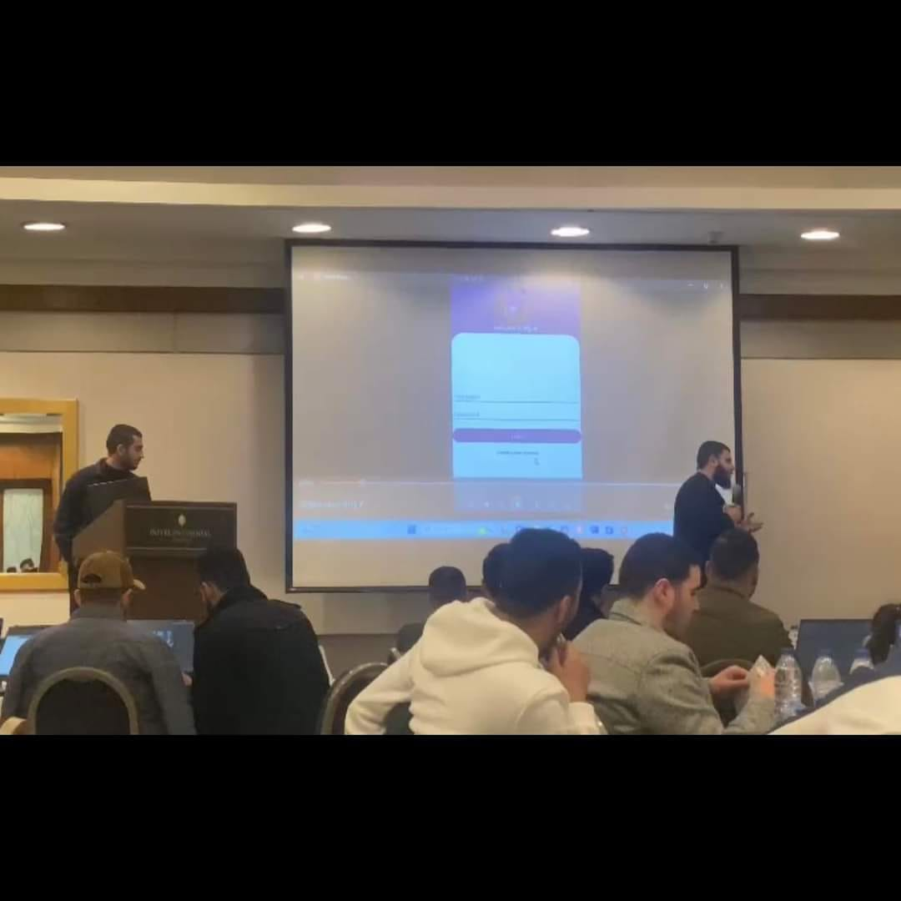

# Yazan Alawneh                                                                              
**Android Native Developer**

- **Phone**: +962 776603514  
- **Email**: [yazanalawneh.999@gmail.com](mailto:yazanalawneh.999@gmail.com)  
- **LinkedIn**: [linkedin.com/in/yazan-alawneh-536a02287](https://www.linkedin.com/in/yazan-alawneh-536a02287/)  
- **GitHub**: [github.com/yazan-alawneh999](https://github.com/yazan-alawneh999)  
- **Location**: Amman, Jordan

## Experience

### Freelancing Android Development  
**2023 - Present**  
Extensive experience in Android development, specializing in user-centric applications with robust architectures. Proficient in Java, Kotlin, Android SDK, and Jetpack Compose. Skilled in UI/UX design, efficient data management with Room and LiveData, and integrating APIs with Retrofit and Firebase.

### ICDL Instructor  
**IQ Academy**  
**2022 - Present**  
Provide essential computer skills training and digital literacy education, helping learners achieve ICDL certification through lectures and hands-on training.

## Workshops
- **Data Science - Orange Data Science Academy**  
  Gained insights into data analysis and machine learning, aiming to integrate AI into my products.

## Hackathons
- **UAE Hackathon**  
  Participated in a generative AI hackathon, developing an AI generator app for images and text based on user queries. This project inspired dynamic, personalized content and improved user experience.

## Career Objective
Seeking a challenging career with a progressive organization to capitalize on my technical skills in IT.

## Education
- **Computer Science**  
  **Al-Yarmouk University**  
  **2018 - 2023**  
  Graduated with a 70.9 GPA, provided tutoring in algorithms, numerical methods, and AI. My graduation project, CarShop AI, simplifies car buying by aggregating car listings with personalized recommendations.

## Technical Skills
- **Android**: Java, Kotlin, Clean Architecture, MVVM, Dagger Hilt, Coroutines, RxJava, JSON, Retrofit, Room, SQL, Paging 3, Jetpack Compose, View/Data Binding, Navigation Component, Material Design
- **Other Languages**: Python (Intermediate)

## Personal Skills
- Strong written/verbal communication
- Time management, organizational skills, punctuality, reliability
- Leadership and motivational abilities

